A modern, secure, and scalable online school management system built with React (Vite) for the frontend and Node.js (Express) for the backend, with HTML-based report viewer for real-time reports.

This system manages students, attendance, exams, billing, communications, and boarders, integrating QR codes and secure student pickup verification for safety.

🧰 Tech Stack

Frontend: React (Vite) + TailwindCSS

Backend: Node.js + Express

Database: MySQL

Authentication: JWT + Role-Based Access Control (Admin, Teacher, Student, Parent)

Notifications: WhatsApp, SMS, Email, Portal Messages

Reporting: HTML + Report Viewer

Extras: QR Code Integration for students, Live Chat

⚙️ Key Features

Student and teacher registration and management

Attendance tracking (manual or automated)

QR code integration for student identification

Student pickup and bus pickup verification for secure pick-up

Role-based dashboards: Admin, Teacher, Student, Parent

Student portals with personalized dashboard and notifications

Exams module: term exams, mock exams, mid-term, terminal reports

Report card and performance report generation

Fee collection, arrears management, and billing automation

Canteen sales and expense tracking

Receipt generation (digital and printable)

WhatsApp, SMS, Email, and portal messages notifications

Live chat for communication between staff, students, and parents

Management of boarders (hostel assignments, rules, and monitoring)

Comprehensive analytics dashboards for school operations

Secure login and role-based access control

Multi-branch support and scalability for larger institutions

🖼️ Screenshots

| 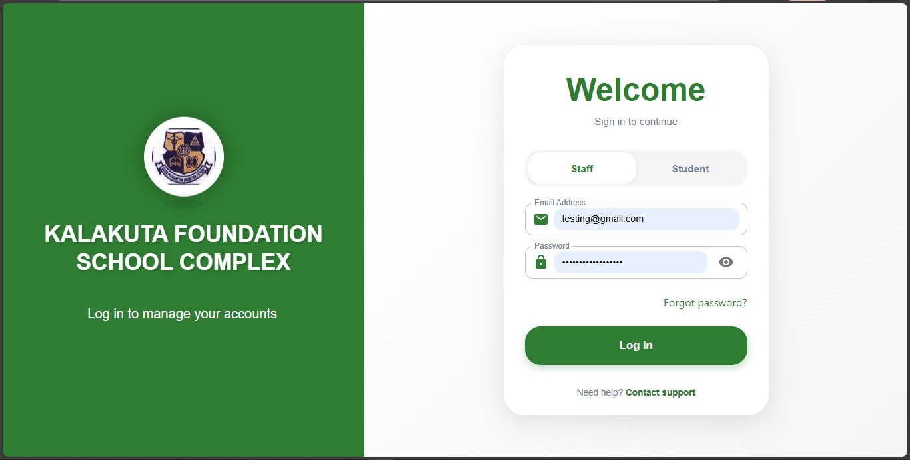 | 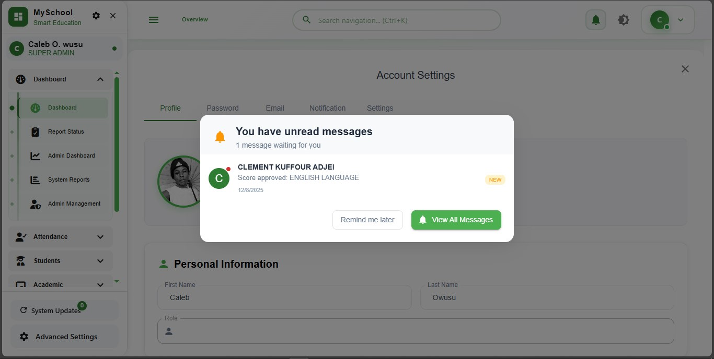 |
| 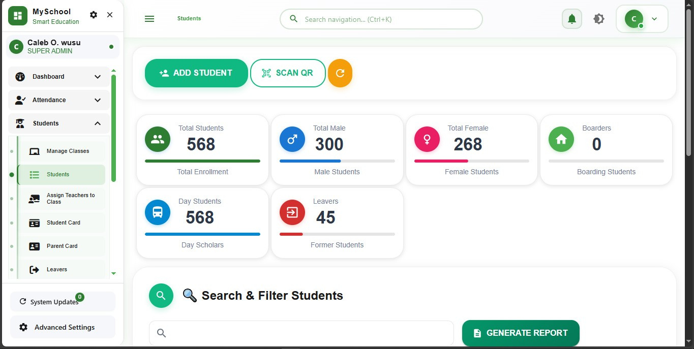 | 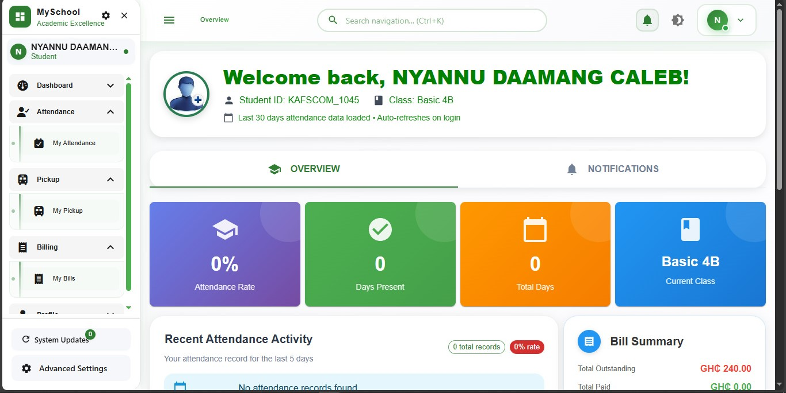 |
| 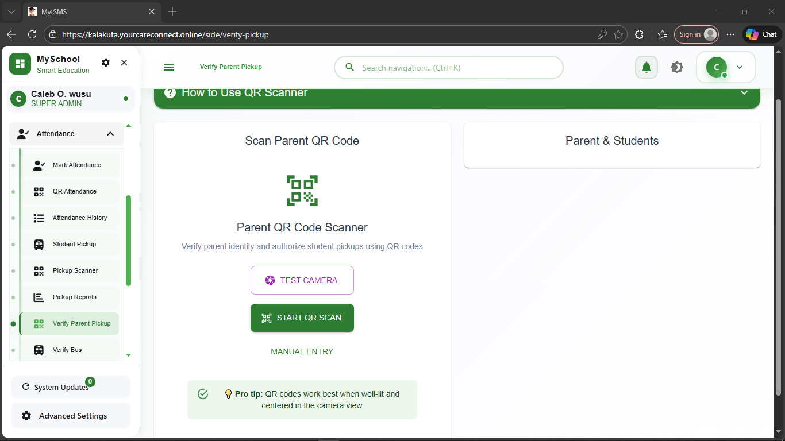 | 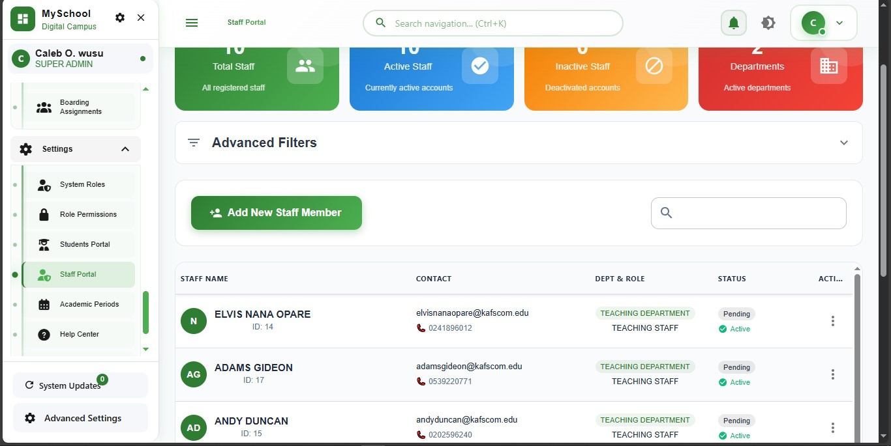 |
| 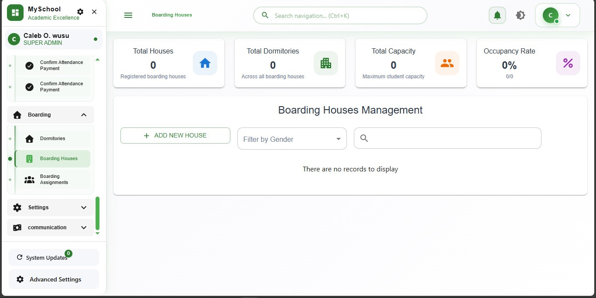 | 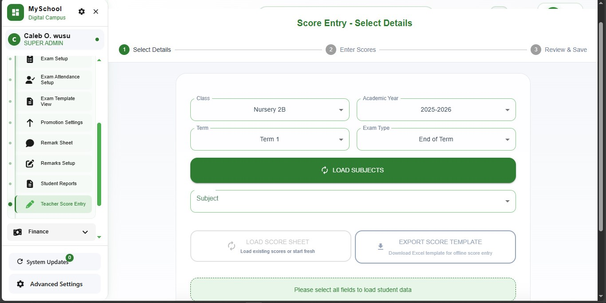 |
| 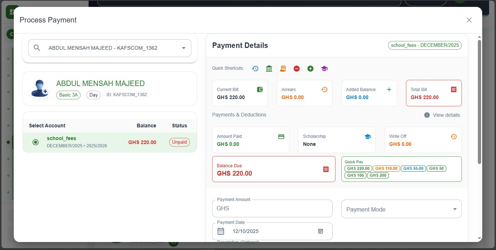 | 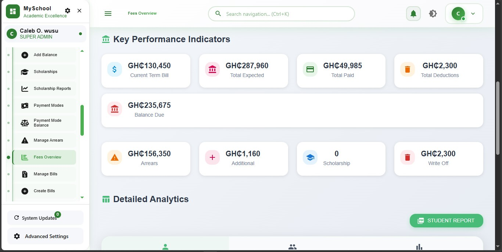 |
| 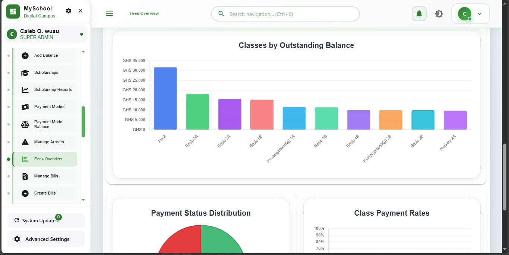 |  |
| 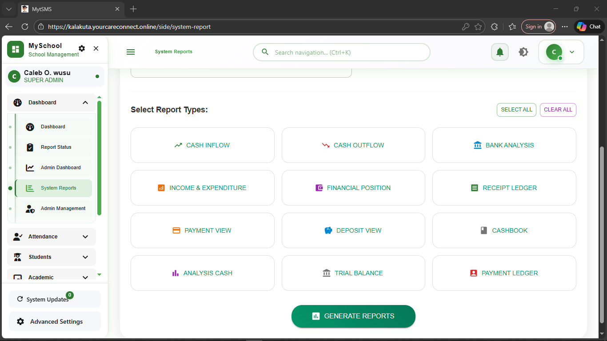 | 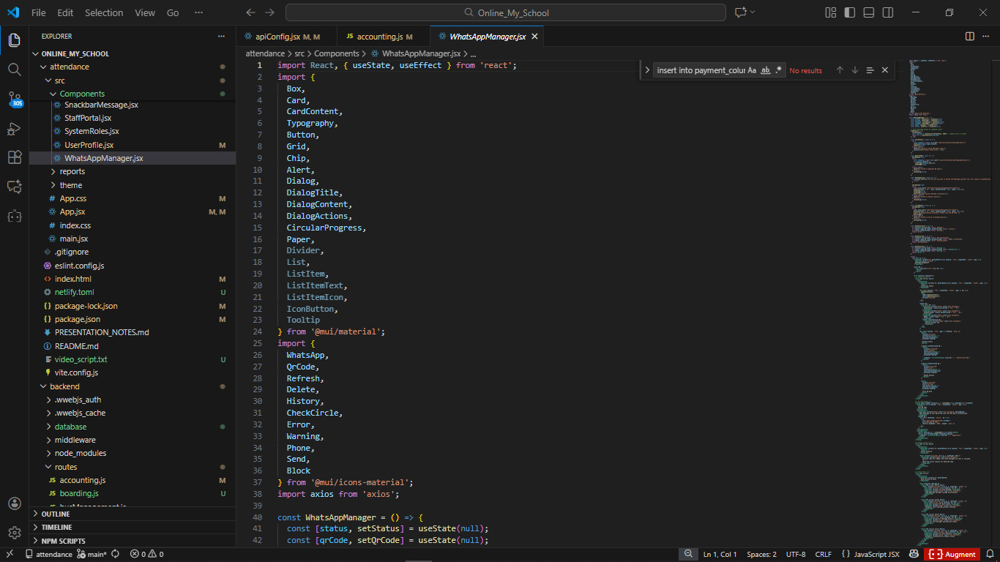 |

Note: Only a few representative screenshots included; system contains many more modules covering full school operations.
