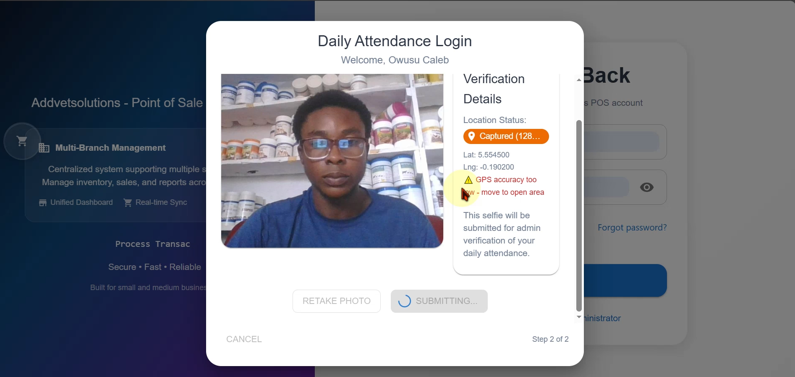
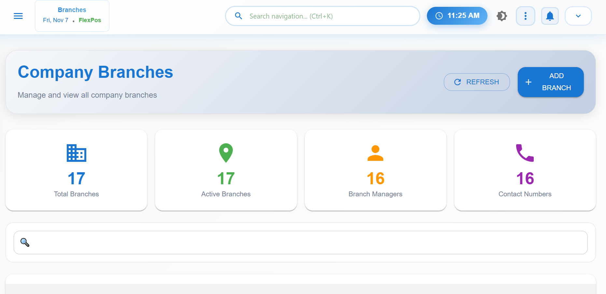
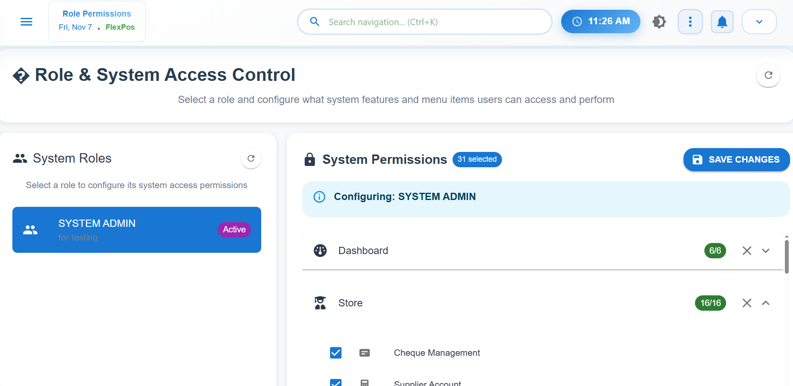
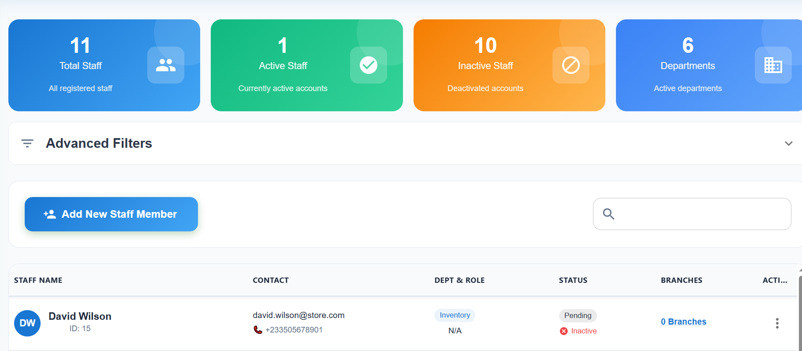
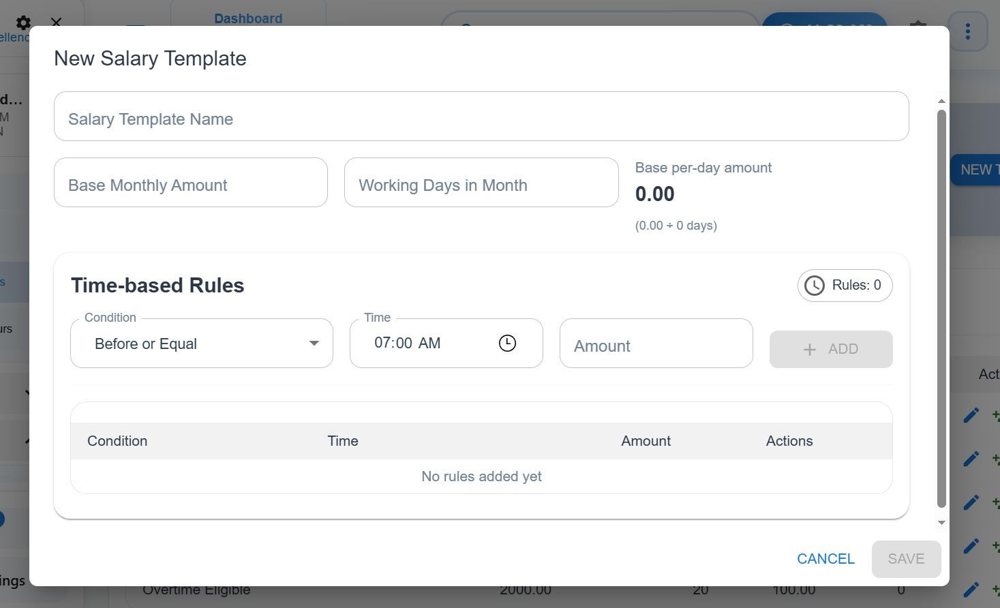
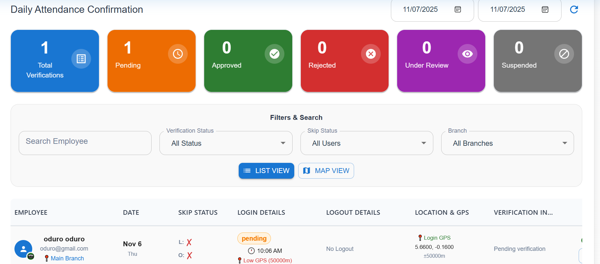
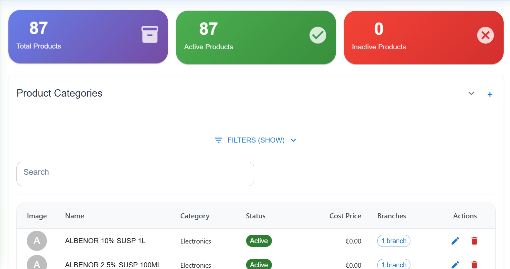
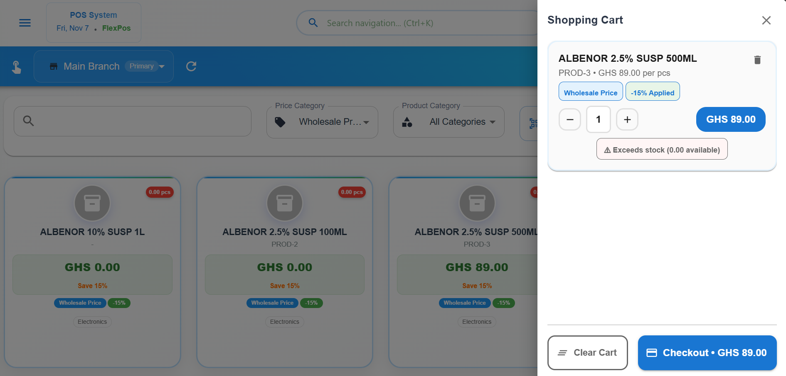
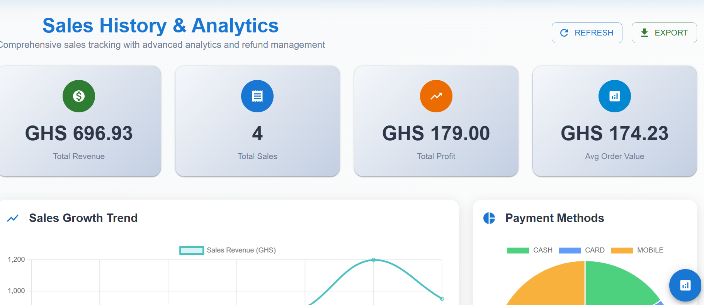
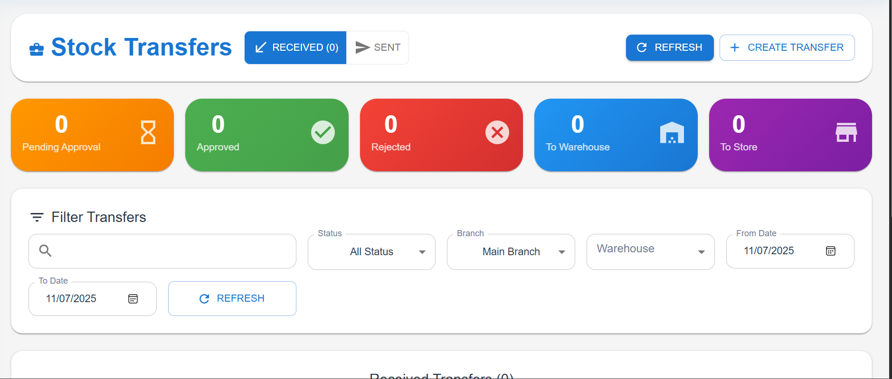

# 🟩 Multi-Branch POS System with GPS + Selfie Attendance Tracking

A comprehensive enterprise-level Point of Sale and workforce management system designed for organizations operating across multiple branches.  
It unifies **sales, inventory, and HR modules** — providing real-time insights into operations, staff performance, and financial activity.

---

## 🧠 Overview

This system enables administrators to manage products, branches, staff, and roles from a central dashboard.  
Each branch operates independently but syncs data to the main server.  
Attendance is captured through **selfie + GPS location**, and employees earn **salary points** automatically based on punctuality and the salary rules defined in the system.

---

## 👨‍💻 Role
**Full-stack Developer** — designed and implemented the frontend, backend API, database schema, and deployment architecture.

---

## 🧰 Tech Stack

| Layer | Technologies |
|-------|---------------|
| **Frontend** | React (Vite), TailwindCSS |
| **Backend** | Node.js, Express |
| **Database** | MySQL |
| **Authentication** | JWT Authentication |
| **Other Tools** | GPS API, Camera Integration, Cloudinary (for photo uploads), REST API, Nginx (for deployment) |

---

## ⚙️ Key Features

- 🔹 Multi-branch management with centralized control  
- 🔹 Staff attendance tracking with **selfie + GPS verification**  
- 🔹 Automatic salary point calculation based on attendance and role-based rules  
- 🔹 Role & permission management (Admin, Manager, Cashier, etc.)  
- 🔹 Branch creation and assignment of staff  
- 🔹 Operation hours setup and enforcement  
- 🔹 Product and inventory management per branch  
- 🔹 POS terminal with receipt generation and daily summaries  
- 🔹 Stock transfer between branches and warehouses  
- 🔹 Stock adjustment, check, and expense management  
- 🔹 Salary registration and staff salary review  
- 🔹 Real-time dashboard analytics for admin overview  
- 🔹 Comprehensive attendance management and approval system  
- 🔹 Detailed sales, product, and user activity history  
- 🔹 Fully responsive web interface for desktop and mobile  
- 🔹 And more advanced modules supporting continuous scalability and automation, etc.

---

## 🖼️ Screenshots

| Login (Selfie + GPS) | Branch Management | Role Permissions |
|-----------------------|------------------|------------------|
|  |  |  |

| Staff Registration | Salary Setup | Attendance Management |
|--------------------|---------------|------------------------|
|  |  |  |

| Product Management | POS Terminal | Sales History |
|--------------------|---------------|----------------|
|  |  |  |

| Stock Transfer | Check Management |
|----------------|------------------|
|  |  |

---

## 📊 System Status

✅ Fully functional and production-ready  
✅ Deployed on internal servers for multi-branch use  
✅ Built to support additional modules (HR, payroll, reporting)  

---

## 👤 Author

**OWUSU CALEB TETTEH**  
Full Stack Developer — Java, React, Node.js, Django, and MySQL  
📧 Email: owuzucaleb@gmail.com  
🌐 Portfolio: https://github.com/scritpworks

---

