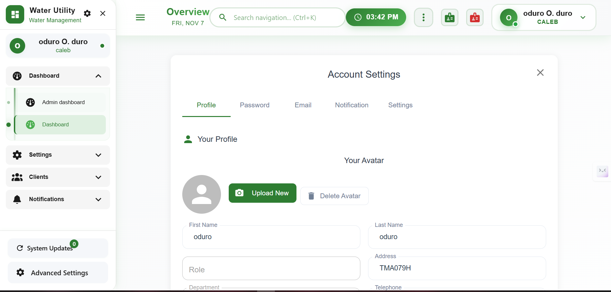
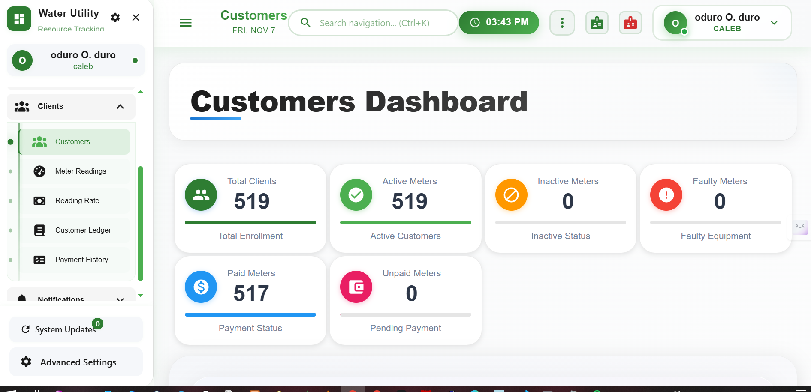
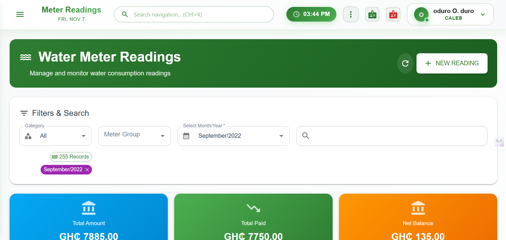
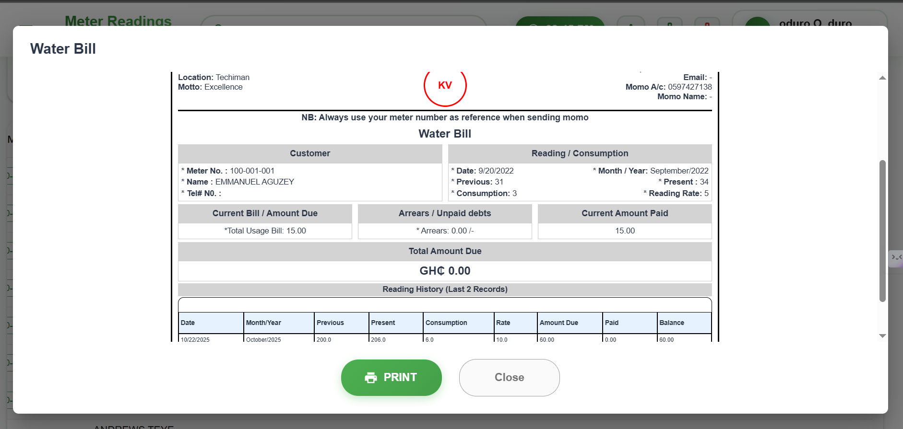

Water Utility Management System — React + Node.js + Vite + MySQL

A modern, secure, and efficient Water Utility Management System built with React (Vite) for the frontend and Node.js (Express) for the backend, powered by a MySQL database.
It helps water service providers manage customers, meter readings, billing, and payments — all in one unified platform.

⚙️ Tech Stack

Frontend: React (Vite) + Tailwind CSS

Backend: Node.js (Express.js)

Database: MySQL

Authentication: JWT with HttpOnly Cookies for secure sessions

Architecture: RESTful API + Component-based Frontend

Deployment: VPS / Cloud-based setup

👤 Role

Full Stack Developer — Responsible for designing database models, building secure REST APIs, integrating frontend with backend, and ensuring smooth billing and reporting workflows.

🧩 Key Features

🔒 Secure Login System with JWT + HttpOnly Cookies

👥 Customer Management — Add, update, and monitor customers

💧 Meter Reading Module — Record and track monthly readings

💵 Billing & Receipts — Auto-generate bills and digital receipts

📊 Dashboard Overview — Track usage, payments, and arrears in real time

🧾 Reports — Export monthly and yearly summaries

🧠 Role-based Access Control (Admin / Staff)

🚀 Optimized REST APIs for high performance

🌐 Responsive UI — Works on desktop, tablet, and mobile

📸 Screenshots/image folder

Below are selected views from the system:

|  |  |
|  |  |
|  |

(and many more — the system includes additional dashboards and utilities not shown here.)

🧠 System Overview

The Water Utility System automates the entire water management workflow — from customer registration and meter reading to bill generation and payment tracking.
It provides an intuitive dashboard for both administrators and field staff, ensuring real-time visibility into consumption, arrears, and revenue trends.

The backend exposes a RESTful API, secured using JWT (stored in HttpOnly cookies) to prevent XSS attacks, while the frontend consumes these APIs via Axios for seamless data sync.

🧾 Billing & Reporting Engine

Auto-calculates water bills based on meter readings

Generates and prints digital receipts instantly

Tracks arrears, payments, and outstanding balances
